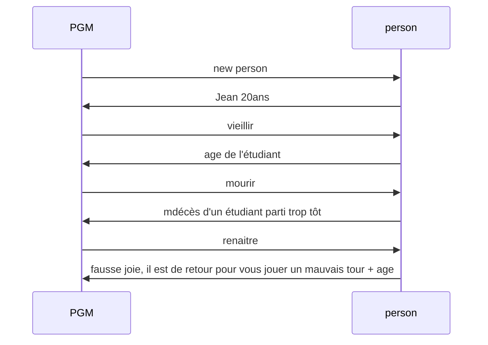
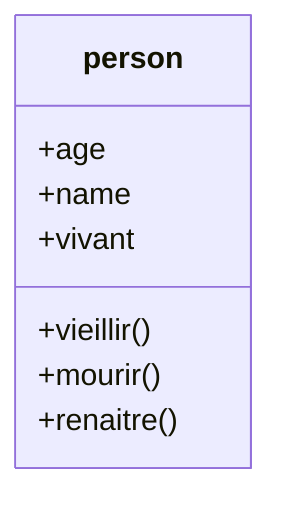
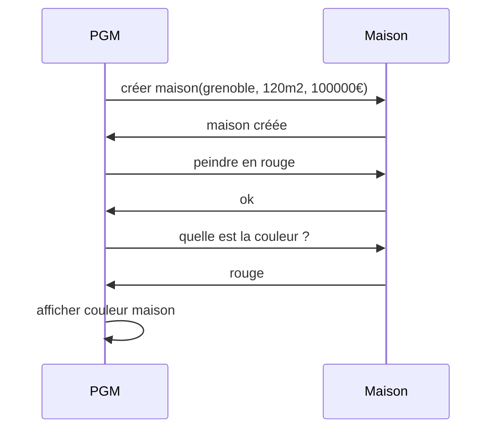
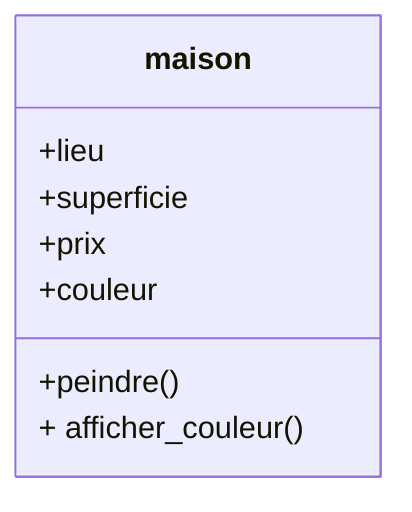

# DEVOIR LEROUX ULM

# exerice 1

```bash
class Person {
  public name: string;
  public age: number;
  public vivant: boolean = true;

  constructor(name, age) {
    this.name = name;
    this.age = age;
    this.vivant = true;
  }

  veillir() {
    this.age++;
  }

  mourir() {
    this.vivant = false;
    console.log("Mesdames, Messieurs, Aurevoir");
  }

  renaissance() {
    this.age = 0;
    this.vivant = true;
  }


const student = new Person("Jean", 20);
student.veillir();
console.log("age de l'étudiant", student.age);
student.mourir();
console.log("décès d'un étudiant parti trop tôt");
student.renaissance()
console.log("fausse joie, il est de retour pour vous jouer un mauvais tour", student.age);
```

## le diagramme de séquence



## le diagramme de classe



# exercice 2 

### le diagramme de séquence donné


### le diagramme de classe

### le code 

```bash

class maison
{
  public lieu: string;
  public couleur: string;
  public superficie: number;
  public prix: number;

    constructor(lieu, superficie, prix) {
    this.lieu = grenoble;
    this.superficie = 120;
    this.prix = 100000;
    }

    peindre() {
        this.couleur = "rouge"; 
    }

    afficher_couleur(){
        return this.couleur;
    } 

}

const newmaison = ma_maison("maison créée");
const couleur = peindre ();
const afficher_couleur = afficher_couleur();
console.log(" la maison est de couleur rouge");
```