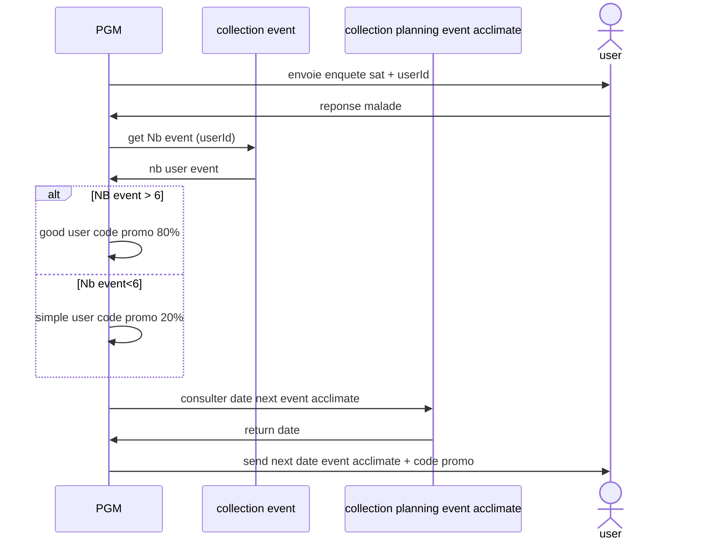
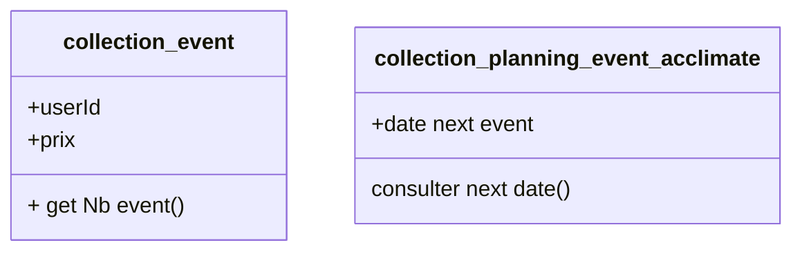
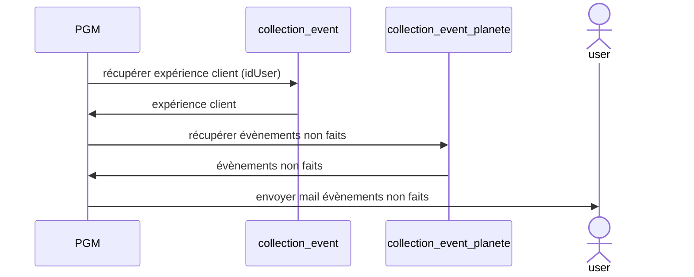
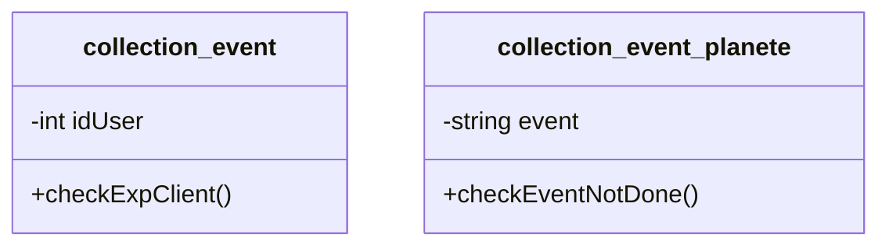

# Planete Event

Pouvoir faire des simulations de visites de planètes.

Tunnel d'achat : fidélisation

## Cas : le client a été malade lors d'un "event" et répond au questionnaire de satisfaction

### Diagramme de séquence



### Diagramme de Classe



### codage Typescript

``` typescript
class collection_event {
  public userId: string;
  public prix: int;
 
  constructor (userId: string, prix :int) {
      }

  get_nb_event() {

}}

class planning_event_acclimate{
  public userId: string;
  public prix: int;
 
  constructor (userId: string, prix :) {
      }

  get_nb_event() {

}}
 
```

## cas de la création d'un envoie de mail pour tester les nouvelles planètes pour un client 

### Diagramme de séquence
 
#### Envoie d'un mail avec les nouvelles planètes non effectuées
 

 
### Diagramme de classes
 
